# **How to Deploy a run-time Micro Frontend Application using AWS**

This article is a continuation of my series on micro frontends. You’ll need to have completed at least the [first tutorial](create-micro-frontend-react.md) to be able to follow along (links to previous articles)

There’s a link to the source code in both of the above articles if you’d rather get stuck into the AWS side of things instead.

Once you’re up to speed with the code, it’s time to ship it!

## High level overview
We need to compile our code for each of our applications and deploy it to the web. We then need to have our container application know how to access each of these applications, so that it can pull it all together. To do this we’ll need to do the following:
* Add our code to GitHub
* Write some production webpack config
* Set up a CI/CD pipeline using GitHub actions
* Create an S3 bucket to hold our code
* Create a CloudFront distribution which will serve the code from the correct S3 bucket.
* Create a user that GitHub can use to deploy with

For this tutorial, you will need an AWS account. You can sign up for a free account on their website. You’ll be required to put in your credit card details, but so long as you’re just using it for this tutorial, you shouldn’t be charged anything.

## Adding our code to GitHub
If you’ve been following along with the tutorials so far, you will need to commit your code and push it to a new GitHub repo. I’m going to assume that you already know how to do this, so I’ll move on.

## Webpack production config
In the previous tutorials we added some dev and some common config to the config folder in each of our applications. The purpose of the common config was to store config that would be used both in dev and production. Now that we’re ready to deploy, let’s create that production config. We’ll start with our container:


```javascript
// container/config/webpack.prod.js
const { merge } = require('webpack-merge')
const ModuleFederationPlugin = require('webpack/lib/container/ModuleFederationPlugin')
const commonConfig = require('./webpack.common')
const packageJson = require('../package.json');

const domain = process.env.PRODUCTION_DOMAIN;

const prodConfig = {
    mode: 'production',
    output: {
        filename: '[name].[contenthash].js',
        publicPath: '/container/latest/'
    },
    plugins: [
        new ModuleFederationPlugin({
            name: 'container',
            remotes: {
                helloReact: `helloReact@${domain}/helloReact/latest/remoteEntry.js`,
                helloVue: `helloVue@${domain}/helloVue/latest/remoteEntry.js`
            },
            shared: packageJson.dependencies
        })
    ]
}

module.exports = merge(commonConfig, prodConfig)
```

Some of this looks pretty similar to the dev config. Let’s take a closer look at the helloReact remote entry in the ModuleFederationPlugin.

```javascript
helloReact: `helloReact@${domain}/helloReact/latest/remoteEntry.js`,
```

It follows the same pattern, we have the name followed by @ followed by a path to the remoteEntry.js file. All that has changed is that path to the file. We’re now expecting the file to be on a `${domain}` which is defined on line 6 as the environment variable `PRODUCTION_DOMAIN`. We will define this environment variable in our CI/CD pipeline later on.

We’ve changed the mode to `production` which tells webpack to do some optimisations to the code when it compiles it.

The other section that is new is the `output` section. The filename gives a pattern for webpack to follow when it’s creating a name for the compiled output of this project. It will be the name of the file followed by the contents of the file hashed. This is done primarily for caching purposes, which we’ll more of later in the article, but essentially it will mean that our most up to date code will be used instead of a cached version. The `publicPath` will be used to prepend the filename any time it is imported in our app. We’re going to end up with several different paths in our S3 bucket for each of our child applications, so it’s important for us to specify that this is for the container here.

Once we’re done with the config file, we need to add a new script to package.json to allow us to actually build it.

```javascript
// container/package.json
"scripts": {
    "start": "webpack serve --config=config/webpack.dev.js",
    "build": "webpack --config=config/webpack.prod.js"
},
```

A good test at this point is to navigate to the container directory in a terminal and run `npm run build`. It should hopefully run successfully without any error and create a `dist` folder with a bunch of minified files. If you did get an error at this point, check for any typos, or have a look at [my repo](https://github.com/richardtbell/microfrontend-hello-world/tree/88e60f96ff85abf4d55c9deb0f7a6de7eb7aab14) at this point in time.

Now let’s add config for our helloReact child app:

```javascript
// helloReact/config/webpack.prod.js
const { merge } = require('webpack-merge')
const ModuleFederationPlugin = require('webpack/lib/container/ModuleFederationPlugin')
const commonConfig = require('./webpack.common')
const packageJson = require('../package.json');

const domain = process.env.PRODUCTION_DOMAIN;

const prodConfig = {
    mode: 'production',
    output: {
        filename: '[name].[contenthash].js',
        publicPath: '/helloReact/latest/'
    },
    plugins: [
        new ModuleFederationPlugin({
            name: 'helloReact',
            filename: 'remoteEntry.js',
            exposes: {
                './HelloReactApp': './src/bootstrap'
            },
            shared: packageJson.dependencies
        })
    ]
}

module.exports = merge(commonConfig, prodConfig)
```

You’ll notice that the ModuleFederationPlugin is identical to the dev version. You could extract this into the common config if you want to, but I’ve left it here mainly to make the changes we’re making easier to follow in this tutorial.

We’ve added the same `filename` and `publicPath` like in the prod config. Again, we want to add a build script into our package.json file and make sure it runs without error:

```javascript
"build": "webpack --config=config/webpack.prod.js"
```

Finally, we’ll do the exact same thing for our helloVue child app. You can copy across the `helloReact/config/webpack.prod.js` file and change any references to `helloReact` to be `helloVue` instead. Again, add the build script and run it to make sure there are no errors.
If you’ve had any issues, you can see my code at this point [here](https://github.com/richardtbell/microfrontend-hello-world/tree/dcff11476357c11ef73b172bad7982fff879db7c).

## Create our CI/CD pipeline
We want to have a pipeline which will automatically deploy our code to production when we merge any changes to master. In order to do this, we’re going to make use of GitHub actions.

In the root folder of your application create a new folder named `.github/workflows`. Create a file in this folder called container.yml:

```yaml
# .github/workflows/container.yml
name: deploy-container

on:
  push:
      branches:
        - master
      paths:
        - 'packages/container/**'

defaults:
  run: 
    working-directory: packages/container

jobs: 
  build:
    runs-on: ubuntu-latest

    steps: 
      - uses: actions/checkout@v2
      - run: npm install
      - run: npm run build
        env: 
          PRODUCTION_DOMAIN: ${{ secrets.PRODUCTION_DOMAIN }}

      - uses: ItsKarma/aws-cli@v1.70.0
        with: 
          args: s3 sync packages/container/dist s3://${{ secrets.AWS_S3_BUCKET_NAME }}/container/latest
        env: 
          AWS_ACCESS_KEY_ID: ${{ secrets.AWS_ACCESS_KEY_ID }}
          AWS_SECRET_ACCESS_KEY: ${{ secrets.AWS_SECRET_ACCESS_KEY }}
      
      - uses: ItsKarma/aws-cli@v1.70.0
        with: 
          args: cloudfront create-invalidation --distribution-id ${{ secrets.AWS_DISTRIBUTION_ID }} --paths "/container/latest/index.html"
        env:
          AWS_ACCESS_KEY_ID: ${{ secrets.AWS_ACCESS_KEY_ID }}
          AWS_SECRET_ACCESS_KEY: ${{ secrets.AWS_SECRET_ACCESS_KEY }}
```

This might look quite daunting at first glance, but it’s actually quite simple when we go through it line by line. We first give the workflow a name which will be used to identify the workflow on your GitHub actions tab.

Next we specify that this workflow should run when the master branch is pushed and there are changes in the folder `packages/container/`. If you have used separate repos for each of your apps, this may look different for you.

After that we specify that the working directory should be `packages/container` meaning that any commands run after this point will run from within this folder.

The next section contains all the logic we need to build and deploy our container to AWS. We specify what environment it should run on (`ubuntu latest`), then tell it to checkout our code, install dependencies and compile our code by running `npm run build`.

This is where we define our `PRODUCTION_DOMAIN` environment variable that we made use of earlier. We’re going to make use of GitHub secrets so that we’re not committing secret information to a public repo.

After this we will use the [ItsKarma/aws-cli](https://github.com/ItsKarma/aws-cli) docker image to copy our compiled code to S3 and create a CloudFront invalidation.

Copying to S3 should look straightforward enough. We’re giving it our `dist` directory and telling it to sync it to the s3 bucket.

Creating the CloudFront invalidation is a step that we need to do in order to invalidate the cache for our newly deployed code. These two steps should hopefully make more sense to you as we continue on.

Now we can test out that our pipeline is working from the GitHub side. The workflow will fail as we’ve not specified any of the AWS values yet, but we should be able to see the workflow install dependencies and build our code. All we need to do is make a small change in the `packages/container` folder and then commit our code and push it up. I’m just going to change `container/package.json` so that the `name` field is spelled `containr`.
Once you push that up, when we go to the “Actions” tab in our GitHub repo, we should see the workflow running:

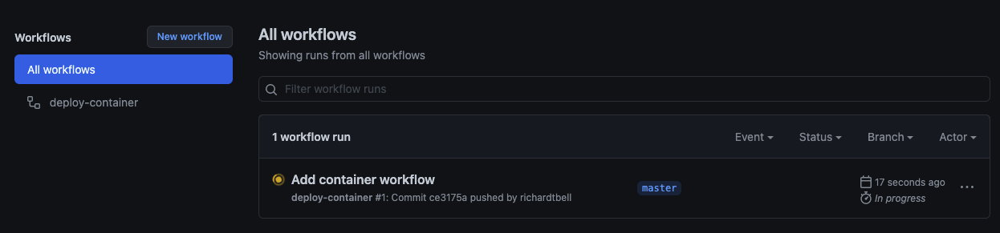

It should quickly fail however:

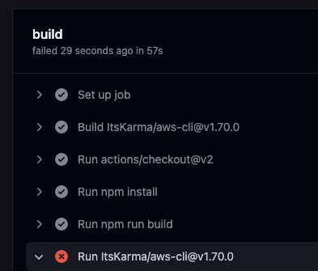


Great! You can see that it installed dependencies and built successfully. Now let’s set up AWS.

## Create S3 Bucket
If you’ve not yet created your AWS account, please do that now. Sign in and search for “S3”. Somewhere on this page you should see a “Create bucket” button. Click that and you should go to a page which looks something like this:

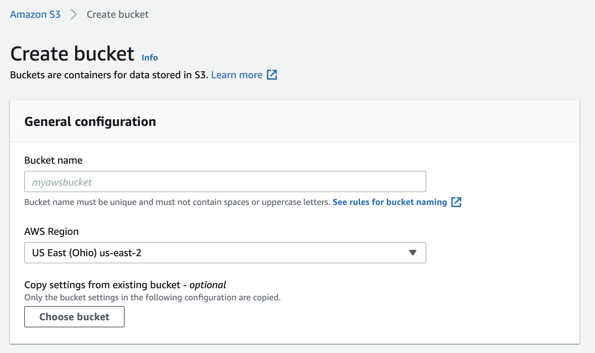


You’ll need to give your Bucket a unique name, and I’d recommend you leave the AWS Region to whatever it defaulted to for you. Take a note of the region code on the right. For me it’s `us-east-2`. We’ll make use of this in a moment. For now you can ignore the rest of the settings and click “Create bucket”.

Now you should see your bucket appearing in a table. Under access you’ll notice that it should say “Bucket and objects not public”. This is the default for S3 buckets that are created, but for the purposes that we’re looking to use this for, we absolutely need to have our bucket contents accessible by the public.

Click on your bucket and go to the “Properties tab”. Scroll down until you see “Static website hosting” and click edit on this.

We’ll change this value to “Enable” and specify our index document as `index.html`. The rest of the values should be left blank.


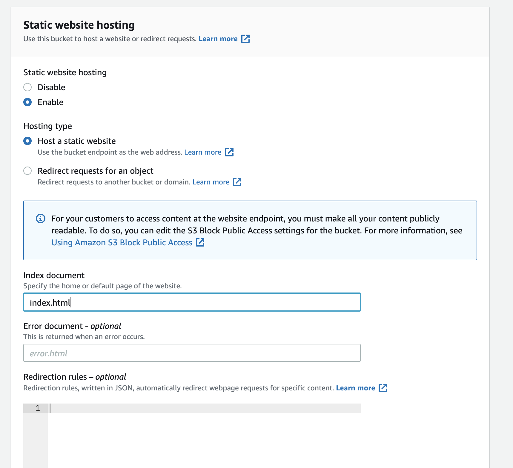


Scroll further down and click on “Save changes”.

Next we’re going to go to the “Permissions” tab and click on Edit in the section titled “Block public access (bucket settings)”. All you’re going to do here is uncheck this box and click on save

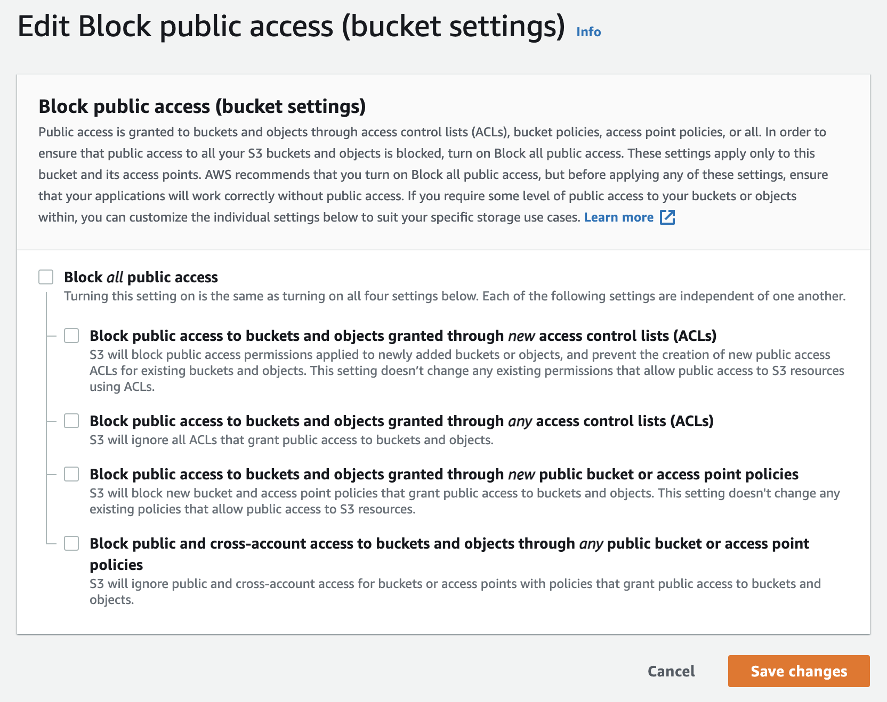

You’ll get warned at this point that the objects in this bucket will become publicly accessible, but remember, that is exactly what we want to happen here.

So this now gives us an S3 bucket that we will be able to use to store our production files. We’ll be making use of CloudFront in order to serve these files, but first we need to create a “bucket policy” which basically says that CloudFront can do something with our bucket.

## Creating a Bucket Policy
On the same page that we edited “Block public access (bucket settings)”, the next section should be titled “Bucket policy”. Click edit here.

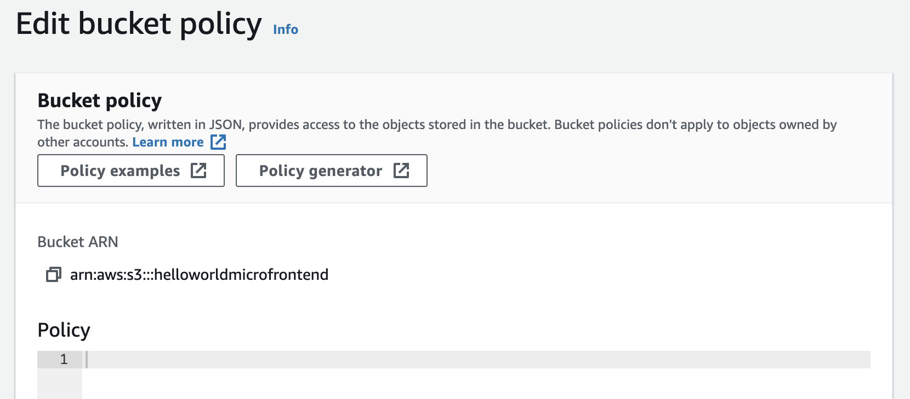


First copy the Bucket ARN to the clipboard (yours will have a different value based on the name you gave your bucket). Then click on the “Policy generator” button.

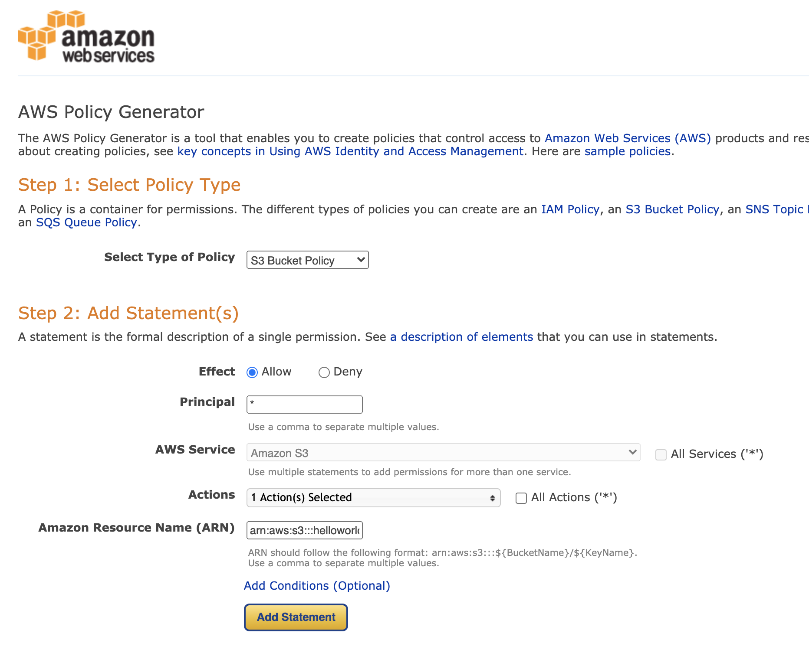


First choose “S3 Bucket Policy” as the type of policy. Add a star into the Principal field and for the Actions you’ll need to scroll down the list and choose “GetObject”. Next paste your ARN value into the field and add a `/*` at the end. So mine turns into `arn:aws:s3:::helloworldmicrofrontend/*`

Then click on “Generate policy” and copy all the text inside the box (highlighted in the screenshot below).

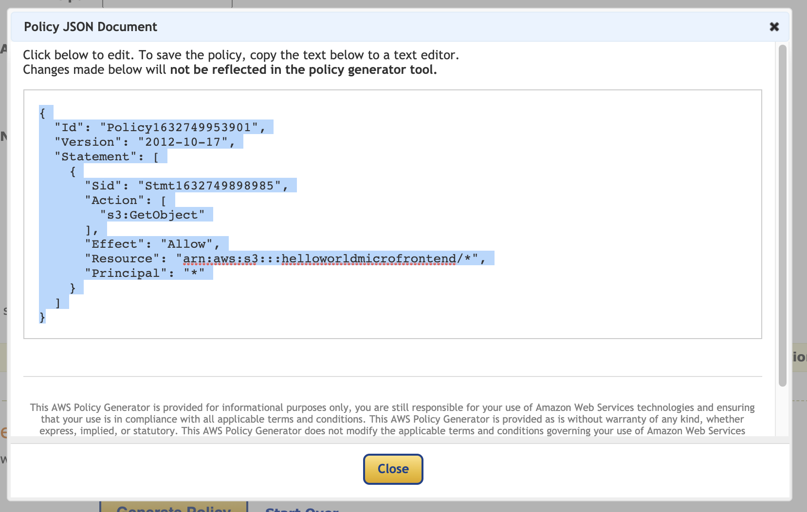


Take your code back to the “Edit bucket policy” page and paste it into the Policy section.

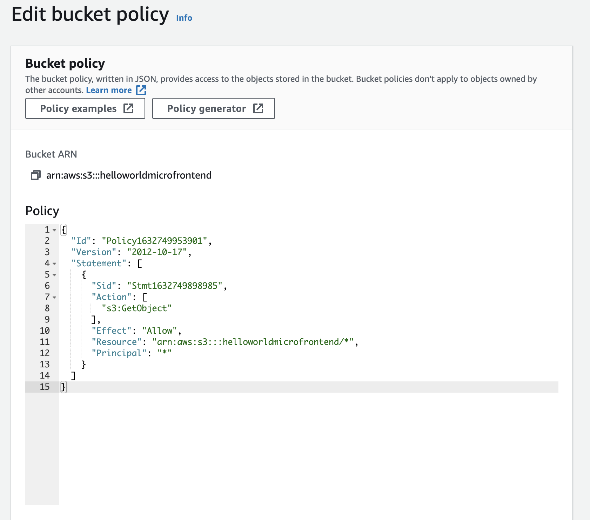


Click on save and then we’re done with the bucket and ready to create a distribution on CloudFront.

## Create CloudFront Distribution
Open up a new tab on AWS and this time we’ll search for “CloudFront”. Once there, click on “Create distribution”. This looks a little intimidating, but don’t worry, we’ll not be making too many changes.

First choose the “Origin domain” by clicking on the input box and selecting the S3 bucket that we just created. We don’t need to make any other changes in this section, so we’ll scroll down to the next section titled “Default cache behaviour” where we’ll change the “Viewer protocol policy” to “Redirect HTTP to HTTPS”

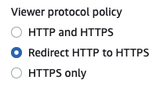


After this you can scroll right down to the end and click “Create distribution”. We’ll need to make a few more changes once the distribution has finished deploying. You should be on a page that looks something like the screenshot below, but if not, you can click on the name of the distribution and it should take you there.

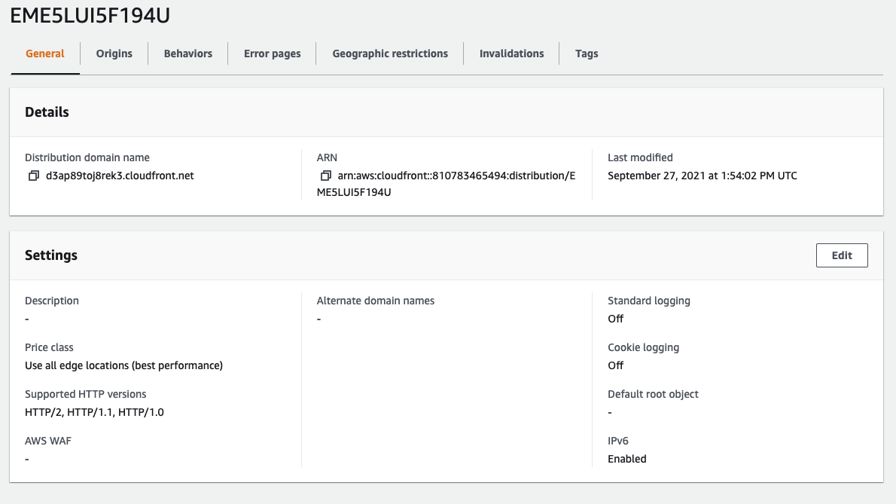


We’re going to click on the “Edit” button. Scroll down to the field “Default root object” and add `/container/latest/index.html` then save changes.

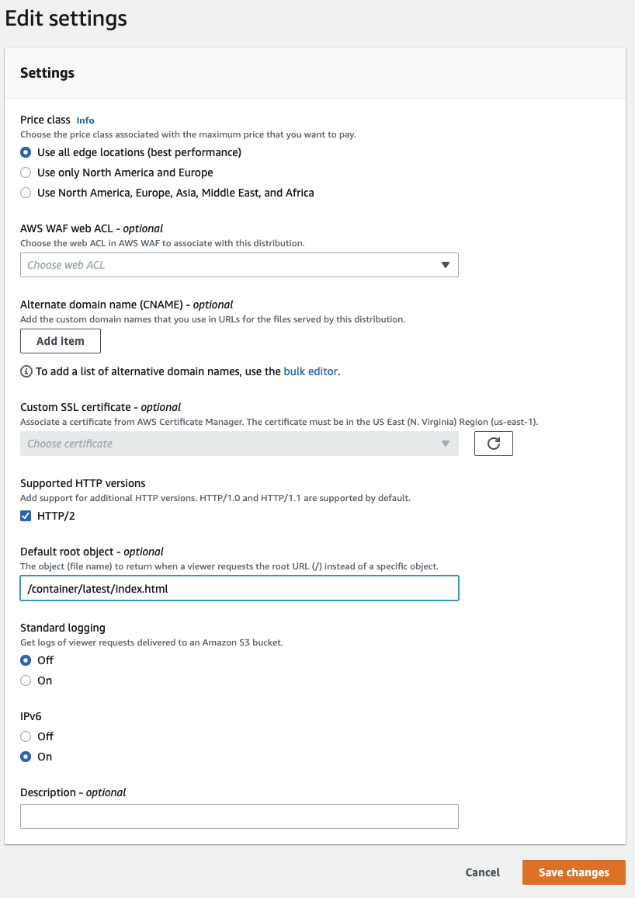

Next go to the “Error pages” tab and click on “Create custom error response”. Choose 403: Forbidden from the first dropdown, then choose to give it a customized error response. Give it the same path we just filled in above `/container/latest/index.html` and change the response code to 200: OK.

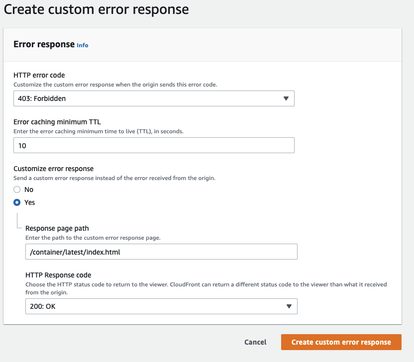

We’re almost done with our AWS set up. One thing that we still need to do is add some of our AWS access keys into our GitHub secrets so that our workflow file can reference them. If you recall, some of the values that we have are `AWS_ACCESS_KEY_ID` and `AWS_SECRET_ACCESS_KEY` which we need to use to be able to access our AWS account. You can think of them like a username and password. In order to get these, we need to set up a user that GitHub can use.

## Creating an AWS user for GitHub
Open up a third tab with AWS and search for IAM. Click on the users section on the left and then click to “Add user”.

Give it a name which makes sense to you and give it “Programmatic access”

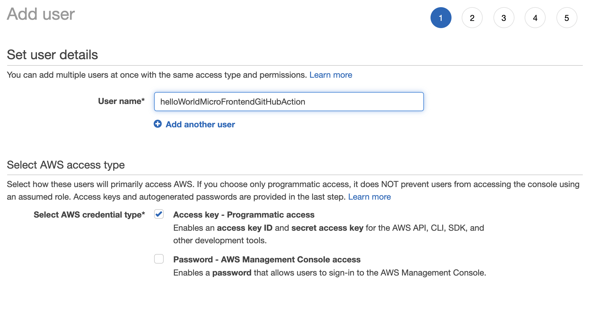


Clicking “Next” will bring you to the permissions tab. At this point you should really look into how you can give your user only the access that they actually require. In order to get this working a little quicker, I’m just going to give the user wide access as I intend to delete them after I finish this tutorial.

Click on “Attach existing policies directly” and select “AmazonS3FullAccess”.

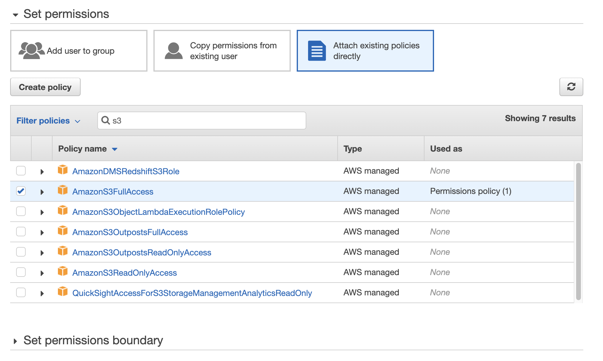


Next search for CloudFront and select “CloudFrontFullAccess”

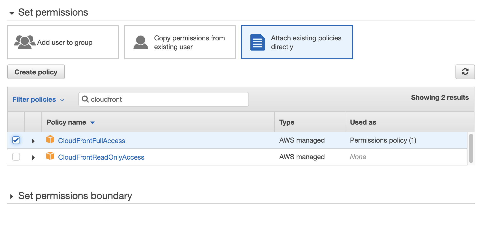


You can then click “Next” until you “Create user”. You’ll then be shown your user with the values we’re looking for. DO NOT close this tab. We will need these values as they’re only going to be **displayed this one time**.

## Adding secrets to GitHub
In a new tab, go to GitHub to the repo that you created for this tutorial. Click on “Settings” and then “Secrets” on the left.


Click on “New repository secret” and let’s add our Access Key ID.

Give it a name corresponding to the value we set in our workflow file `AWS_ACCESS_KEY_ID` and copy the value from the tab I told you not to close.

Repeat this step to add the `AWS_SECRET_ACCESS_KEY` as well.

We can also add the other secrets now:
* `AWS_S3_BUCKET_NAME` — this is the unique name that you gave your S3 bucket. If you’ve forgotten, you can go back into the S3 service and it should be in a list.
* `AWS_DISTRIBUTION_ID` — go to CloudFront and you should see the ID listed as the first item in the row.

Now that we’ve got our secrets added, we should be able to re-run our GitHub workflow and it should just work. Go over to GitHub and go to the action that failed previously. You should see a button which says “Re-run job”.

## Deploying our child apps
Now that our container has been deployed we should be able to go see it in production. If you look in CloudFront where you found your `AWS_DISTRIBUTION_ID`, you should also see a “Distribution domain name”. Going to this page will give you a nice blank screen with some yummy errors in the console.

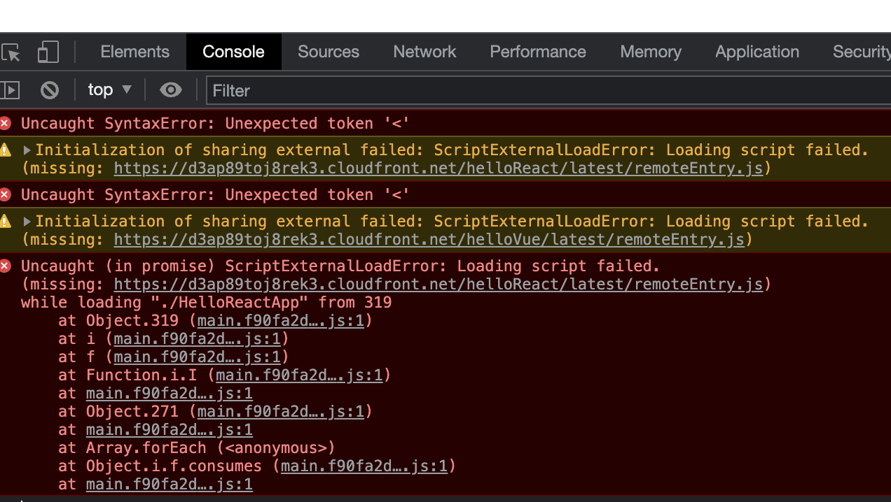


These errors are there because our container is looking for `helloReact` and `helloVue`, but we’ve not deployed them yet.

Creating the workflows couldn’t be easier. Simply copy and paste the container.yml workflow file and change any occurrence of “container” to be “helloReact” and “helloVue” respectively. You’ll need a file for each.

```yaml
# .github/workflows/helloReact.yml
name: deploy-helloReact

on:
  push:
      branches:
        - master
      paths:
        - 'packages/helloReact/**'

defaults:
  run: 
    working-directory: packages/helloReact

jobs: 
  build:
    runs-on: ubuntu-latest

    steps: 
      - uses: actions/checkout@v2
      - run: npm install
      - run: npm run build
        env: 
          PRODUCTION_DOMAIN: ${{ secrets.PRODUCTION_DOMAIN }}

      - uses: ItsKarma/aws-cli@v1.70.0
        with: 
          args: s3 sync packages/helloReact/dist s3://${{ secrets.AWS_S3_BUCKET_NAME }}/helloReact/latest
        env: 
          AWS_ACCESS_KEY_ID: ${{ secrets.AWS_ACCESS_KEY_ID }}
          AWS_SECRET_ACCESS_KEY: ${{ secrets.AWS_SECRET_ACCESS_KEY }}
      
      - uses: ItsKarma/aws-cli@v1.70.0
        with: 
          args: cloudfront create-invalidation --distribution-id ${{ secrets.AWS_DISTRIBUTION_ID }} --paths "/helloReact/latest/index.html"
        env:
          AWS_ACCESS_KEY_ID: ${{ secrets.AWS_ACCESS_KEY_ID }}
          AWS_SECRET_ACCESS_KEY: ${{ secrets.AWS_SECRET_ACCESS_KEY }}
```

```yaml
# .github/workflows/helloVue.yml
name: deploy-helloVue

on:
  push:
      branches:
        - master
      paths:
        - 'packages/helloVue/**'

defaults:
  run: 
    working-directory: packages/helloVue

jobs: 
  build:
    runs-on: ubuntu-latest

    steps: 
      - uses: actions/checkout@v2
      - run: npm install
      - run: npm run build
        env: 
          PRODUCTION_DOMAIN: ${{ secrets.PRODUCTION_DOMAIN }}

      - uses: ItsKarma/aws-cli@v1.70.0
        with: 
          args: s3 sync packages/helloVue/dist s3://${{ secrets.AWS_S3_BUCKET_NAME }}/helloVue/latest
        env: 
          AWS_ACCESS_KEY_ID: ${{ secrets.AWS_ACCESS_KEY_ID }}
          AWS_SECRET_ACCESS_KEY: ${{ secrets.AWS_SECRET_ACCESS_KEY }}
      
      - uses: ItsKarma/aws-cli@v1.70.0
        with: 
          args: cloudfront create-invalidation --distribution-id ${{ secrets.AWS_DISTRIBUTION_ID }} --paths "/helloVue/latest/index.html"
        env:
          AWS_ACCESS_KEY_ID: ${{ secrets.AWS_ACCESS_KEY_ID }}
          AWS_SECRET_ACCESS_KEY: ${{ secrets.AWS_SECRET_ACCESS_KEY }}

```


Once you’ve done that, you’ll need to make a small change to each package so that the workflow will run, just like we did for the container. Simply changing the package.json name slightly should be enough again.

Once your workflows have finished, refresh your production url and it should all be working! If you had any issues, you can see the finished project on [GitHub](https://github.com/richardtbell/microfrontend-hello-world/tree/master).
