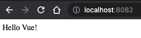

# **How to add Vue (or another framework) to your React Micro Frontend**

In my [previous post](create-micro-frontend-react.md) I walked you through how to create a basic hello-world micro frontend application which leveraged the use of webpack and React to integrate components at run time.

This article is going to be a continuation of that article, so if you’ve not had a chance to go through it, open the above in a new tab and come back here when you’re done.

## Motivation
Why would you want to add Vue (or another framework) to your React based micro frontend? There are a couple of reasons I can think of:
Giving teams autonomy over tech stack.
React may eventually lose favour with the development community and there may be a new better shiny thing. Knowing that we can convert our application bit by bit gives us confidence for the future.
Vue (or another framework) may give you something unique that React does not.

Personally however, I think that too much autonomy between teams can be dangerous. You can end up having “The new shiny tech” done for each of your features, meaning that you’ve probably got a lot of beginner level code from your experienced engineers. It also leads to silos and difficulty in changing teams up. Your application will suffer a little from having to load an extra framework as well.

These are just some pros and cons from me. Your situation will be unique, so just think through the options first.

## Creating helloVue
Hopefully I’ve not put you off and you’re still reading. We’re going to start by creating a very basic “hello Vue” application on it’s own port. Create a new repo (or subfolder) called helloVue.

Since we’re using Vue this time, there are some different dependencies in package.json:

```json
// helloVue/package.json
{
  "name": "helloVue",
  "version": "1.0.0",
  "scripts": {
    "start": "webpack serve --config=config/webpack.dev.js"
  },
  "dependencies": {
    "vue": "^3.0.0"
  },
  "devDependencies": {
    "@babel/core": "^7.12.3",
    "@babel/plugin-transform-runtime": "^7.12.1",
    "@babel/preset-env": "^7.12.1",
    "babel-loader": "^8.1.0",
    "html-webpack-plugin": "^4.5.0",
    "vue-loader": "^16.0.0-beta.9",
    "webpack": "^5.4.0",
    "webpack-cli": "^4.1.0",
    "webpack-dev-server": "^3.11.0",
    "webpack-merge": "^5.2.0"
  }
}
```

Make sure and do an `npm install` once you’ve got that. Next we’ll copy over the public/index.html file and change the id that we’ll mount to.

```html
<!--helloVue/public/index.html-->
<!DOCTYPE html>
<html>
<head></head>

<body>
    <div id='hello-vue-dev-app'></div>
</body>

</html>
```

Now let’s add our `src` files. Create a new folder `scr` and create three new files, `index.js` (which can be a copy from helloReact), `bootstrap.js` and `App.vue`.

```html
<!--helloVue/src/App.vue-->
<template>
  <div>
    {{ message }}
  </div>
</template>

<script>
export default {
  data() {
    return { message: "Hello Vue!" };
  },
};
</script>
```

```javascript
// helloVue/src/bootstrap.js
import { createApp } from 'vue'
import App from './App'

const mount = (el) => {
    const app = createApp(App)
    app.mount(el)
}

if (process.env.NODE_ENV === 'development') {
    const devRoot = document.querySelector('#hello-vue-dev-app')
    if (devRoot) {
        mount(devRoot)
    }
}

export { mount }
```

```javascript
// helloVue/src/index.js
import('./bootstrap')
```

You can see that we’re doing the same things here as in the helloReact app. We’re mounting our app in the `bootstrap.js` file and importing this file in `index.js` so that webpack can manage any shared dependencies asynchronously. The vue file is just a simple hello world example that I got running quickly. I don’t know anything about Vue, so hopefully I’ve not done anything too unforgivable in 13 lines of code :)

I think we’re ready to run the app, so let’s copy over our webpack config from helloReact and make a few minor tweaks.

```javascript
// helloVue/config/webpack.common.js
const { VueLoaderPlugin } = require('vue-loader')

module.exports = {
    resolve: {
        extensions: ['.js', '.vue']
    },
    module: {
        rules: [
            {
                test: /\.vue$/,
                use: 'vue-loader'
            },
            {
                test: /\.m?js$/,
                exclude: /node_modules/,
                use: {
                    loader: 'babel-loader',
                    options: {
                        presets: ['@babel/preset-env'],
                        plugins: ['@babel/plugin-transform-runtime'],
                    }
                }
            }
        ]
    },
    plugins: [new VueLoaderPlugin()]
}
```

```javascript
// helloVue/config/webpack.dev.js
const { merge } = require('webpack-merge')
const HtmlWebpackPlugin = require('html-webpack-plugin')
const commonConfig = require('./webpack.common')
const ModuleFederationPlugin = require('webpack/lib/container/ModuleFederationPlugin')
const packageJson = require('../package.json')

const devConfig = {
    mode: 'development',
    output: {
        publicPath: 'http://localhost:8082/'
    },
    devServer: {
        port: 8082,
        historyApiFallback: {
            index: '/index.html'
        }
    },
    plugins: [
        new ModuleFederationPlugin({
            name: 'helloVue',
            filename: 'remoteEntry.js',
            exposes: {
                './HelloVueApp': './src/bootstrap'
            },
            shared: packageJson.dependencies
        }),
        new HtmlWebpackPlugin({
            template: './public/index.html'
        })
    ]
}

module.exports = merge(commonConfig, devConfig)
```

The dev config is pretty much the same except we’ve changed our port to `8082` and changed the `name` and `exposes` values to “helloVue” and “./HelloVueApp” respectively.

The common config has a few changes specifically to get Vue working. We’ve added in the `VueLoaderPlugin` and we’ve made sure that webpack can resolve `.vue` files. This is in the common config as we’ll need to make use of it in production as well.

That should be it! Let’s fire up our terminal, and type `npm start` from your helloVue folder. Going to http://localhost:8082 in a browser should look like this:



## Integrating with our Micro Frontend container
Great, so it works independently! Now let’s integrate it in our container app. All the changes we’re going to make here will be in our container folder.
First off, let’s add a new remote for our helloVue app in the `webpack.dev.js` file:

```javascript
// container/config/webpack.dev.js
const { merge } = require('webpack-merge')
const commonConfig = require('./webpack.common')
const ModuleFederationPlugin = require('webpack/lib/container/ModuleFederationPlugin')
const packageJson = require('../package.json')

const devConfig = {
    mode: 'development',
    output: {
        publicPath: 'http://localhost:8080/',
    },
    devServer: {
        port: 8080,
        historyApiFallback: {
            index: '/index.html'
        }
    },
    plugins: [
        new ModuleFederationPlugin({
            name: 'container',
            remotes: {
                helloReact: 'helloReact@http://localhost:8081/remoteEntry.js',
                helloVue: 'helloVue@http://localhost:8082/remoteEntry.js'
            },
            shared: packageJson.dependencies
        })
    ]
};


module.exports = merge(commonConfig, devConfig)
```

Now we can make use of it in our container app. Let’s create a new component that we can render in the container. Create a new file src/components/HelloVueApp.js which should look pretty similar to the HelloReactApp except we’re not needing to do anything with navigation, so it’s a bit simpler:

```javascript

// container/src/components/helloVueApp.js
import { mount } from 'helloVue/HelloVueApp'
import React, { useRef, useEffect } from 'react'

export default () => {
    const ref = useRef(null);

    useEffect(() => {
        mount(ref.current)
    }, [])

    return <div ref={ref} />
}
```

You may be wondering at this point why this is using React. If you remember though, both the helloReact and container applications are React based.

Finally all we need to do is add a route which will load this component within our `src/App.js` file:

```javascript
// container/src/App.js
import React from 'react';
import HelloReactApp from './components/HelloReactApp';
import { Route, Switch, Router, Link } from "react-router-dom";
import { createBrowserHistory } from "history";
import HelloVueApp from './components/HelloVueApp';

const history = createBrowserHistory();

const Header = () => (
    <div>
        <Link to='/'>home</Link><br />
        <Link to='/react'>use react</Link><br />
        <Link to='/vue'>use vue</Link>
    </div >
)

export default () => {
    return (
        <Router history={history}>
            <Header />
            <hr />
            <Switch>
                <Route path='/vue' component={HelloVueApp} />
                <Route path='/' component={HelloReactApp} />
            </Switch>
        </Router>
    )
}
```

Now we should be able to run our entire micro frontend application. First you’ll need to make sure that the two child applications are running, so navigate to their folders and run `npm start` for each of them. Then in the container folder you can run `npm start` and your application should load on http://localhost:8080. It should look like this:


I know it doesn’t look like much, but this is really exciting! You’re running a Vue application in your React micro frontend.

If you had any problems along the way, you can find the source code for this tutorial on [github](https://github.com/richardtbell/microfrontend-hello-world/tree/c4f1094929e8457d3bbaaaac5840889fb0c13c9c).

Please have a look at the next article in this series which walks you through how to deploy your application to production using AWS and GitHub actions. (link to next article)